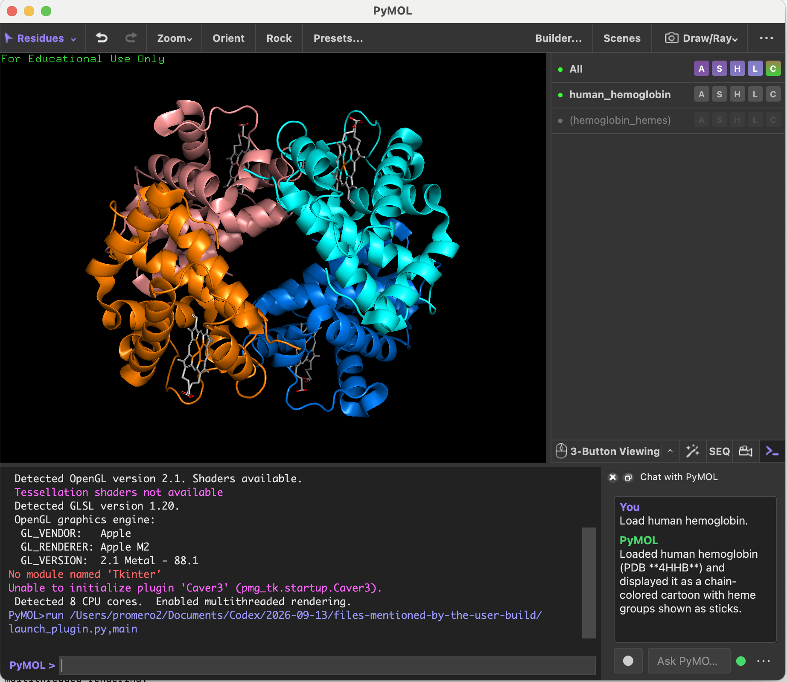

# Chat with PyMOL

Chat with PyMOL adds a compact natural-language assistant directly to the PyMOL interface. It can inspect the active session and perform PyMOL operations from typed or spoken requests while keeping the molecular viewer as the main workspace.



## Install on macOS

The packaged application is the easiest installation method. It supports Apple Silicon and Intel Macs and does not require Terminal commands or Python package installation.

1. Install PyMOL and place `PyMOL.app` in your **Applications** folder.
2. Download `Chat-with-PyMOL-macOS.dmg` from the [latest release](https://github.com/RomeroLab/pymol-chat/releases/latest).
3. Open the downloaded DMG.
4. Drag **Chat with PyMOL** onto the **Applications** shortcut.
5. Open **Chat with PyMOL** from Applications. The launcher will find PyMOL and open the assistant automatically.
6. Paste an OpenAI API key when prompted. Use the link in that window to create or manage keys.
7. On the first voice request, allow microphone access for **PyMOL Chat Voice**.

The API key is stored in the macOS login Keychain. It is never embedded in the application or saved in PyMOL session files. A green dot beside the options menu means a key is active.

> This development build is ad-hoc signed. If macOS blocks the first launch, Control-click **Chat with PyMOL**, select **Open**, and confirm. A future Developer ID-signed and notarized release will not require this workaround.

For detailed installation help and troubleshooting, see [docs/INSTALL.md](docs/INSTALL.md).

## Use

Open a structure using PyMOL's normal controls, then type a request and press Return. For example:

- `Show the protein as a cartoon and color each chain differently.`
- `Select residues within 4 angstroms of the ligand.`
- `Download 2HHB and show the heme groups as sticks.`
- `Make a clean publication-style view.`

Click the microphone once to speak. Recording stops automatically after a short pause. The **⋯** menu contains API key settings and an optional command log.

## Requirements

- macOS 10.15 or newer
- A Qt-based PyMOL 2.x installation
- An OpenAI API key with API billing enabled
- Internet access for OpenAI requests and optional PDB downloads

The default model is `gpt-5.6-sol`. Set `OPENAI_MODEL` to override it in development installations. Voice requests use `gpt-4o-mini-transcribe` by default.

## Privacy and security

- Structure files remain local unless the user explicitly requests a viewport inspection; the application never uploads local structure files.
- Prompt text, compact scene metadata, voice recordings submitted for transcription, and explicitly requested viewport images are sent to OpenAI.
- Temporary recordings, captures, and structures downloaded through `cmd.fetch` are stored under `~/.pymol-chat` by default.
- Generated Python is checked before execution. Shell access, general filesystem access, arbitrary networking, and unsafe PyMOL file-command escapes are blocked.
- Public structure retrieval through `cmd.fetch` is allowed and redirected to the private application directory.

## Development

Clone the repository and launch the development version:

```bash
chmod +x run.sh
./run.sh
```

Either enter an API key through **⋯ → API Key Settings…**, export `OPENAI_API_KEY`, or copy `.env.example` to `.env` and configure it locally. The `.env` file is ignored by Git.

Run the automated tests with PyMOL's Python:

```bash
QT_QPA_PLATFORM=minimal /Applications/PyMOL.app/Contents/bin/python \
  -m unittest discover -s tests -v
```

Build the universal macOS application and DMG:

```bash
./build_dmg.sh
```

The resulting installer is written to `outputs/Chat-with-PyMOL-macOS.dmg`.

## Project structure

- `pymol_chat/ui.py` — native Qt dock and background task handling
- `pymol_chat/agent.py` — Responses API tool loop
- `pymol_chat/executor.py` — live PyMOL execution and safety checks
- `pymol_chat/audio.py` — one-click voice capture and transcription
- `pymol_chat/api_client.py` — dependency-free OpenAI HTTPS client
- `pymol_chat/keychain.py` — macOS Keychain integration
- `voice_helper/` — native silence-detecting microphone helper
- `packaging/` — universal macOS launcher sources
- `build_dmg.sh` — reproducible DMG build script

The model receives two local tools: direct PyMOL/Python execution and optional viewport inspection. Failed commands are returned to the model for correction, up to an eight-step limit.

## License

Chat with PyMOL is released under the [MIT License](LICENSE).
